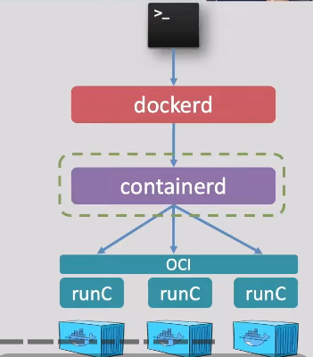
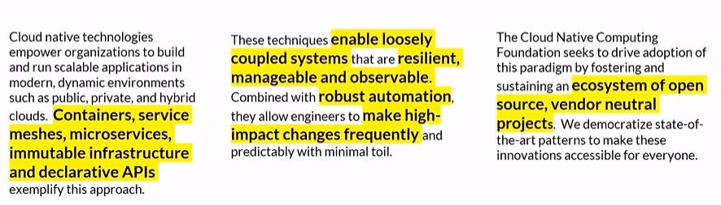
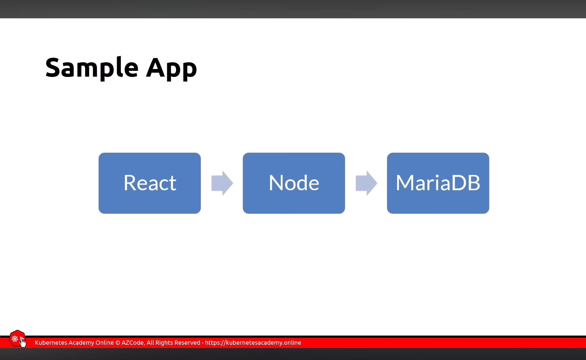
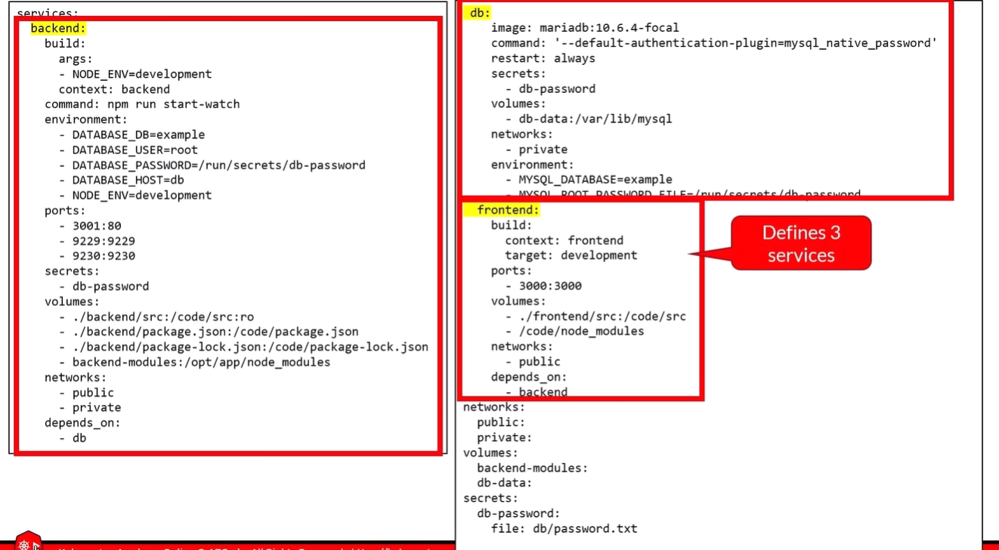
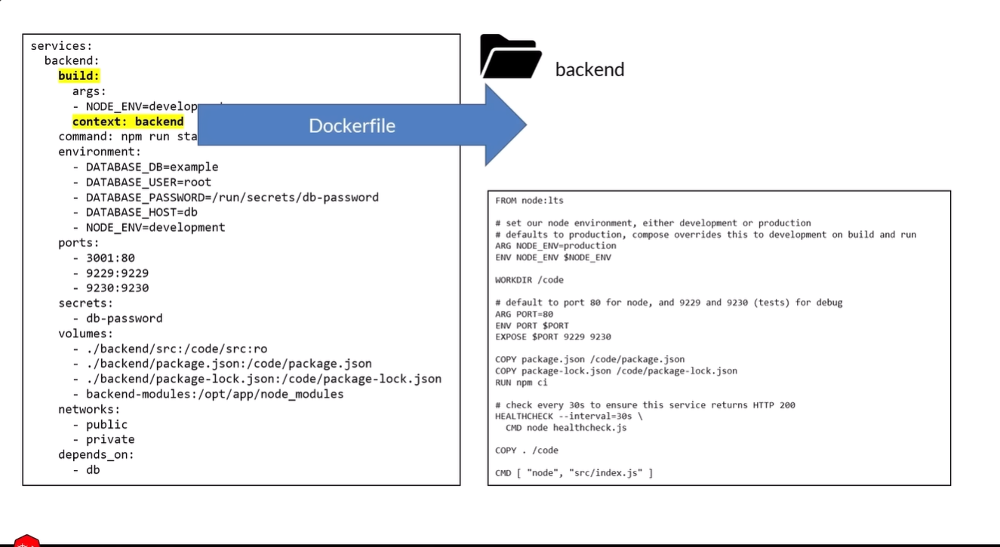
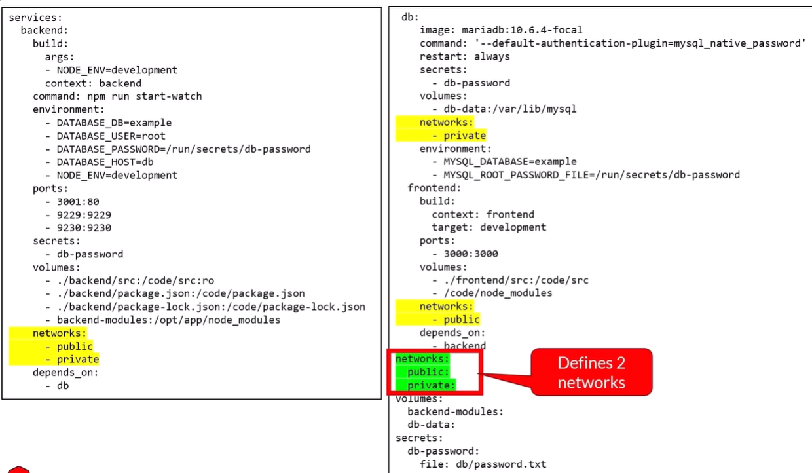

# Docker

physical servers vs virtual machines vs containers
create a free aws accound and a vm to practice
what docker is and docker architecture
dockers commands and how to use them
images and how they are use to create containers
dockerfile
docker registry - Build and publish your images
docker networking
docker compose
persisting container data using volumes and blind mount

why dockers
environment reproducibility: everyone gets the exact same setup.
dependency management: no python hell, conda weirdness or os-specific issues
portablity: Run your container on any machine with docker
Version control for environments: Dockerfiles are text =versionable in git

### servers and virtualization overview

computer device components

introduction to virtualizattion

virtualization enables us to run more than one virtual machines, multiple operating systems and applications on a single physical server
virtual machines are isolated
we can take a snapshot of the vm(a backup)

virtual machines(VM) resources
the hypervisor shares the physical servers resources amoung the virtual machines (VMS)

vcpu, vmemory, vdisk, vnetworkinterfacecard, vram

popular hypervisors providers
VMware vsphere
Xen
Microsoft hyper-v
linux KVM
Oracle VM virtualBox
VMware WorkStation

virtual machines( VMs) - Issues

HeavyWeight (slow to start)
Limited Scalablity
Poor Dev/Test/Prod parity
Redundant OS overhead
inefficient image management
low portablity

from virtualization to containers - The Background

Linux Software Processses overview
A process is a running instances of a program that has its own memory cpu context and system resources, managed by the linux kernal

when you run a program(like bash, nginx or python) the linux kernal:

1. Loads the program's code into memory
2. Allocates it a unique Process Id (PID)
3. Creates a process to executes the code

Containers Overview
A container is a lightweight, isolated process running on a shared operating system kernel, packaged with everything it needs to run , including codes, libraries , environment variables, runtime and configuratin files.

Containers- Features

Doesnot require a separate os
isolated, self contained environments
Faster to create and tear down
Repeatable
portable
Easily scalable

Containerization Overviews
To build, ship and run containers, we need a containers runtime engine be installed on the host's operating system

Docker containers
Starting with a DockerFile, we can build a container images that can be used to consistently run an application across different environments

Virtual machines(Vms)

- heavyWeights(slow to start)
- limited Scalablity
- Low portablitity
- Redundant os overhead
- inefficient image management
- Poor Dev Test/Prod parity

Containers:

- LightWeight (start in milliseconds)
- faster scaling
- Excellent portablity
- containers share the host os kernal
- efficient image management
- containers are excellient for ci/cd

## Docker overview

docker is a software platform that simplifies the process of building , running , managing and distributing applications using containers

### Docker Client

- It enables developers/ users to interact with docker
- when you use docker containers, the docker clients sends these commands to the Docker daemons

### Docker Host

Server of virtual machine on which docker engine is installed
the docker daemmon is the heart of docker

### images

read-only binary templates
application code, lib and dev required to run an application

## Docker Daemon

listen to docker api requests and manages containers , images, networks and volumes
containers images as requested by the client

interface with dockers registires to pull or publish images as requested by the client.

it manages the lifecycle of the containers (start, stop and remove)

### docker containers

encapsulated env in which run application

it package the application and its dep into a single executable unit

### Docker registries

A dockers registry stores docker images

- docker hubs is the public registry that anyone can use
- when needed, the required images can be pulled from the configured registry

#### docker architecture- connecting the dots

cli -> [host] -> [registry]

### Microservices - Drawbacks

- Complexity is added to resolve complexity issues
- is your team trained, ready and has made POCs?
- Don't start with a complex infrastructure

- Testing may appear simpler but is it?

- Deployment may appear simpler but is it?
- hard to do with multiple teams
- One microservices updates can impact many microservices
- Latency issues
- Transient errors(implement retry strategies by service mesh)
- Multiple point of failures
- How about security

## cloud Native foundation definition

1. Containerization
2. CI/CD
3. ORCHESTRATION & APPLICATION DEFINATION
4. OBSERVABLITY AND ANALYSIS
5. SERVICES MESH
6. NETWORKING AND POLICY

### Orchestrator

- Manage
- infrastructure
- Containers
- Deployment
- Scaling
- Failover
- Health monitoring
- App upgrades, Zero-Downtime deployments

install your own
kubernetes, Swarm, Service Fabric

### What is docker

the company

The platform

Open containre initiative (runtime & img specs)

moby project (The container runtime)

Mirantis(Acquired docker enterprise in 2019)

# Docker commands

docker info
docker version
docker login

docker pull [imageName]
docker run [imagename]
docker run -d[ImageName]
docker start [container]
docker ps (list running container)
docker ps -a (list running and stopped container)
docker stop [containerName]
docker kill [containerName]
docker image inspect [imageName]

docker run
docker rm [containerName]
docker rm $(docker ps -a -q)
docker images
docker rmi [imageName]
docker system prune -a

containers are ephemerous and stateless

you usually don't store data in containers

Non-persistant data

- Locally on a writable layers
- its the default, just write to the filsystem
- when conntainers are destroyed, so the data inside them

persistant data
stored outside the container in a volume
A volume is mapped to a logical folder

## volumes cheat sheet

docker create volume [volumename]
docker volume ls
docker volume inspect [volumename]
docker volume rm [volumename]
docker volume prune

<!-- docker run -d --name devtest -v myvol:/app nginx:latest -->

kube-controller-manager
cloud-controller manager
kub-apiserver -------> (The api server exposes a rest api)
|
|
| kube scheduler
etcd

kubectl config current-context
kubcetl config get-context
kubectl config use-context
kubectl delete-context

The declarative ways vs the imperative way

imperative:
Using kubectl commands, issue a series of commands to create resources
Great for learning, testing and troubleshooting
it's like code

Declarative:
Using kubectl and YAML manifests defining the resources that you need
Reproducible, repeatable
Can be saved in source control
it's like data that can be parsed and modified
