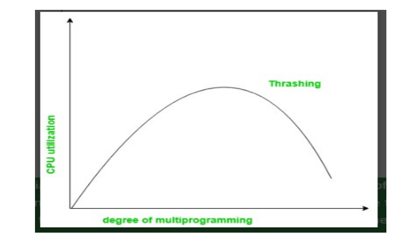

# Memory Management 

Register <--> cache <--> Main Memory <--> Electronic Disk <--> Magnetic Disk <--> Optical Disk <--> Magnetic Tapes
 
## Logical and physical addressing 
- **Logical Address Space:** An address generated by the CPU is known as "Logical Address". It is also known as "Virtual Address". Logical address space can be defined as the size of the process. A Logical address can be changed.

- **Physical Address Space:** physical address space is set of all physical addresses generated after address translation and actually present in main memory(RAM).

## Memory Management:
Operating system resides in a part of main memory, and the rest is used by multiple processes.

The task of subdividing the memory among processes is called memory managment 

Why Memory management is required?
Allocate and deallocate memory before and after process execution.
to keep track of used memory space by processes.
To minimize fragementation issues
to proper utilization of main memory
to maintain data integrity while executing of process.

static and dynamic loadin
Loading a process into main memory is done by a loader. There are two different types of loading:
Static loading: Static loading is basically loading the entire program into fixed address. It requires more memory space.
Dynamic Loading: so the size of a process is limited to the size of physical memory. To gain proper memory utilization, dynamic loading, routine is not loaded until it is called 

static and dynamic linking: 

---
Memory Management Techniques: 

1. Uniprogramming: one the single process can be in the main memory

[OS][One user Process]

Characteristics
- Simple
- No multitasking
- CPU utilization is low 
- Mostly old systems

2. Multiprogramming: Multiple process stay in memory Simultaneously

[OS][P1][P2][P3]

When one process Waits for I/O:
CPU Switches to another process

Result: 
Better CPU Utilization
Faster system performance 

Multiprogramming is divided into:

1. Contiguous Memory Allocation
2. Non-Contiguous Memory Allocation

Contiguous Memory Allocation
1. Single Contiguous Allocation

2. Partitioned Allocation
    Types of Partitions Allocation
- Fixed partitioning
- dynamic partitning

---

## Thrashing:
Few pages of any process are in the main memory 
However, the Os must be clever about how it manages this scheme. In the steady state practically all of the main memory will be occupied with the process pages 

The system spends most of its time swapping pages rather than executing instructions. 
so good page replacement is required

the inital degree of multiprogramming up to some extent of point(lambda), the CPU utilization is very high and the system resources are utilized 100%. But if we further increase the degree of multiprogramming the CPU utilization will drastically fall down and the system will spend more time only on the page replacement the time taken to complete the execution of the process will increase. This situation is called thrashing

**cause of Thrashing:**
Thrashing occurs in a computer system when the cpu spends more time swapping pages in and out of the memory than executing actual processes. This happens when there is insufficient memory , causing frequent pages faults, and excessive paging activity

1. **High degree of multiprogramming:** If the number of processes keeps on increasing in the memory then the number of frames allocated to each process will decreased. So, fewer frames will be available for each process. Due to this, a page fault will occure more frequently and more CPU time will be wasted in just swapping in and out of pages and the utilization will keep on decreasing.

2. **Lacks of Frames**: 
    if a process has fewer frames then fewer pages of that process will be able to reside in memory and hence more frequent swapping in and out will be required. This may lead to thrashinng 

***Recovery of Thrashing***
- Do not allow the system to go into thrashing by instructing the long-term scheduler not to bring the processes into memory after the threshold
- if the system is already thrashing, then instruct the mid-term schedular to suspand some of the processes so that we can recover the system form

---

