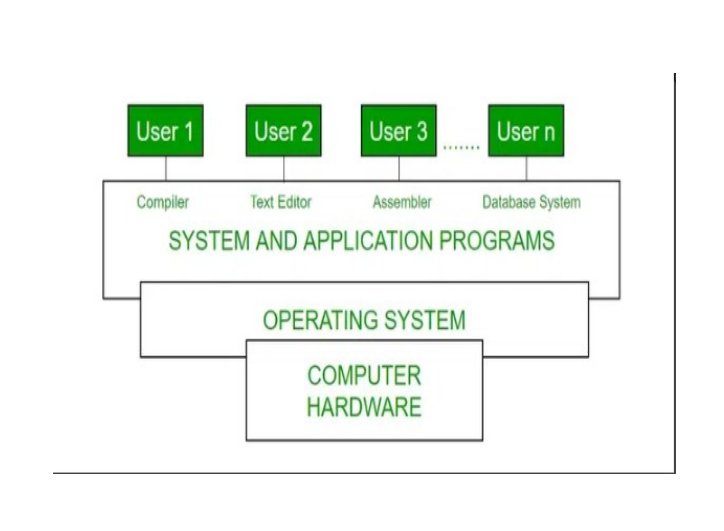

# Operating System Basics

## What is an Operating System?

An Operating system can be defined as an interface b/w user and hardware

## Responsible 
CPU Managements,
File management,
Resource allocation

## Purpose 
- convenient
- efficient manner

Concept of Operating systems

In the computer system(compries of Hardware and software ) Hardware can only understand machine code
SO We need a system which can act as an intermediary and manage all the processes and resources present in the systme

Hardware -> (Operating sytem , {utilities, System software}) , (Application Software , internet Browerse , computer games, databases)

Characterstices of Operating system

## Real-time operating system
- large number of events,mostly external to the computer system must be accepted and processed in a short time or within certain deadlines

such as industrial controls, telephone Switching equipment, flight control and real-time simulations 

processing time measured in tenths of secondss. This system is time-bound and fixed deadline. The processing in this type of system must occur within the specified constraints. Otherwise, This will lead to system failure.

Example of real-time operating system are airline traffic control system, command control system, airline reservation system , heart pacemaker, network multimedia system, robots, etc

<!-- Archtitectures 
Simple Architecture
Monolith Architecture
Micro-kernal Architecture
Exo-kernal Architecture
Layered Architecture
Modular Architecture 
Virtual Machine Architecture -->